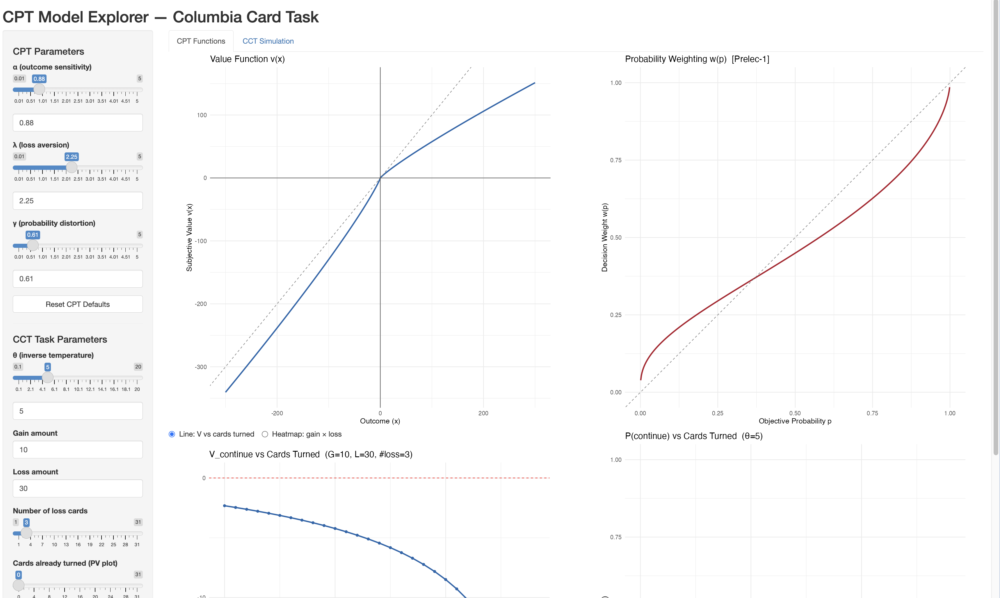

# CPT Model Explorer — Columbia Card Task

An interactive [R Shiny](https://shiny.posit.co/) app for visualizing **Cumulative Prospect Theory (CPT)** and simulating decision-making in the **Columbia Card Task (CCT, hot version)**.

<!-- TODO: uncomment after adding a screenshot

-->

## Background

### What is CPT?

Cumulative Prospect Theory (Tversky & Kahneman, 1992) is the leading descriptive model of decision-making under risk. It captures three key behavioral phenomena:

- **Diminishing sensitivity** — people are less sensitive to changes at extreme outcome values (controlled by **α**)
- **Loss aversion** — losses loom larger than equivalent gains (controlled by **λ**)
- **Probability distortion** — people overweight small probabilities and underweight large ones (controlled by **γ**)

### What is the Columbia Card Task?

The CCT (Figner et al., 2009) is a behavioral measure of risk-taking. In each trial, a participant faces 32 face-down cards. Some cards yield a gain; others cause a loss that ends the trial. The participant decides, card by card, whether to continue turning or stop and collect their accumulated gains. The "hot" version presents cards sequentially, requiring repeated risky choices under evolving probabilities.

### Model Specification

| Component | Formula | Parameter |
|---|---|---|
| Value function (gains) | `v(x) = x^α` | α: outcome sensitivity |
| Value function (losses) | `v(x) = -λ · \|x\|^α` | λ: loss aversion |
| Probability weighting | `w(p) = exp(-(-ln p)^γ)` | γ: probability distortion (Prelec-1) |
| Choice rule | `P(continue) = logistic(θ · V_continue)` | θ: inverse temperature |

The prospect value of continuing is:

```
V_continue = w(p_gain) · v(gain) + w(p_loss) · v(loss)
```

where `p_loss = loss_cards / remaining_cards` increases as more cards are turned.

Default parameters (α = 0.88, λ = 2.25, γ = 0.61) are from Tversky & Kahneman (1992).

## Features

### Tab 1: CPT Functions

Four interactive plots that update in real time:

- **Value Function v(x)** — S-shaped curve over outcomes (-300 to +300), with a linear reference line.
- **Probability Weighting w(p)** — Prelec-1 weighting function over [0, 1], with a diagonal reference.
- **Prospect Value** — Two switchable views:
  - *Line*: V_continue vs. cards already turned (shows cumulative risk).
  - *Heatmap*: gain x loss grid at a given number of cards turned, with V = 0 contour.
- **P(continue)** — Choice probability vs. cards turned, incorporating inverse temperature θ.

### Tab 2: CCT Simulation

- **Single Trial Step-Through** — Simulates one CCT trial card by card. At each step the model-based agent decides continue/stop via the softmax rule. A scrollable table shows each step's decision variables.
- **Batch Simulation** — Runs N trials (default 200) and displays a stacked histogram of cards turned, colored by outcome (green = voluntary stop, red = hit loss card), with summary statistics.

## Getting Started

### Prerequisites

- [R](https://cran.r-project.org/) (>= 4.0)
- R packages: `shiny`, `ggplot2`, `scales`

### Installation

```bash
git clone https://github.com/Jiahao-ZHU/cpt-cct-explorer-shiny.git
cd cpt-cct-explorer-shiny
```

Install dependencies in R:

```r
install.packages(c("shiny", "ggplot2", "scales"))
```

### Run

```r
shiny::runApp()
```

The app will open in your default browser.

## Controls

**CPT Parameters** (sidebar, shared across both tabs):

| Parameter | Range | Default | Meaning |
|---|---|---|---|
| α | 0.01 - 5 | 0.88 | Outcome sensitivity |
| λ | 0.01 - 5 | 2.25 | Loss aversion |
| γ | 0.01 - 5 | 0.61 | Probability distortion |

**CCT Task Parameters** (sidebar):

| Parameter | Range | Default | Meaning |
|---|---|---|---|
| θ | 0.1 - 20 | 5 | Inverse temperature (choice determinism) |
| Gain amount | 1 - 500 | 10 | Points gained per safe card |
| Loss amount | 1 - 500 | 30 | Points lost on loss card |
| Loss cards | 1 - 31 | 3 | Number of loss cards in deck |

All sliders have paired numeric inputs for precise values. Use "Reset CPT Defaults" to restore Tversky & Kahneman (1992) values.

## References

- Tversky, A., & Kahneman, D. (1992). Advances in prospect theory: Cumulative representation of uncertainty. *Journal of Risk and Uncertainty*, 5(4), 297-323.
- Figner, B., Mackinlay, R. J., Wilkening, F., & Weber, E. U. (2009). Affective and deliberative processes in risky choice: Age differences in risk taking in the Columbia Card Task. *Journal of Experimental Psychology: Learning, Memory, and Cognition*, 35(3), 709-730.
- Prelec, D. (1998). The probability weighting function. *Econometrica*, 66(3), 497-527.

## Contributing

Contributions are welcome. Please open an issue first to discuss what you would like to change.

## License

This project is licensed under the MIT License. See [LICENSE](LICENSE) for details.
